# Capstone- Hospital Stay Duration Analysis

## Problem Statement 

Efficient hospital resource management depends heavily on accurately estimating how long patients will remain admitted. **Hospital Length of Stay (LOS)** is a key performance indicator that directly impacts bed availability, staffing schedules, operational costs, and patient flow efficiency. However, LOS is difficult to predict because it depends on multiple interacting factors such as severity of illness, risk of mortality, admission type, discharge disposition, and patient demographics.

Hospitals traditionally rely on historical averages or clinical judgment to anticipate LOS, but these methods fail to account for patient-level variability and often lead to bottlenecks in care delivery, delayed discharges, or inefficient utilization of beds and staff.

This project aims to address that challenge by developing a machine learning model that predicts the expected hospital length of stay for each patient at the time of admission. By analyzing available demographic, administrative, and clinical features (e.g., age group, admission type, severity, mortality risk, payment typology, and patient disposition), the goal is to identify patterns associated with prolonged hospitalization.

The outcome is a predictive framework that can help healthcare administrators forecast bed demand, optimize patient throughput, and improve discharge planning, ultimately supporting better operational decision-making and patient care quality.

This project analyzes a comprehensive hospital dataset from New York State to understand and predict the length of patient hospital stays. It involves exploratory data analysis, feature engineering, and predictive modeling using regression techniques.

## Model Outcomes or Predictions

This project applies a supervised machine learning regression approach to predict the hospital length of stay (LOS) for individual patients based on demographic and clinical factors available at admission. The expected model output is a continuous numerical value representing the predicted number of hospital days, expressed as both log-transformed LOS (for modeling stability) and actual days (for interpretation).

The analysis compared several regression algorithms — including Linear Regression, Ridge, Lasso, ElasticNet, Decision Tree, Random Forest, Support Vector Regression (SVR), and Gradient Boosting Regressor. Among these, regularized linear models (Ridge and Lasso) achieved the most reliable performance, with a test RMSE ≈ 0.69 (log scale) and R² ≈ 0.22, indicating that the model explains approximately 22% of the variation in LOS.

Predictions show that patients with higher illness severity, trauma or emergency admissions, and post-acute discharge dispositions (e.g., skilled nursing, hospice) tend to have significantly longer stays. In contrast, elective or home discharges are associated with shorter LOS. While the model underestimates rare, extreme LOS cases, it provides consistent and interpretable predictions for most hospitalizations.

These outcomes confirm that LOS patterns in this dataset are largely linear and additive, making Ridge regression the most appropriate model for this problem. The resulting model can be leveraged to support hospital bed planning, staffing forecasts, and early discharge coordination by identifying patients likely to experience extended stays.

## Dataset Description: 
The dataset contains records of hospital stays including patient demographics, admission details, clinical severity scores, financial charges, and outcomes.

## Dataset - https://health.data.ny.gov/resource/tg3i-cinn.csv
- **Rows:** 1,000 (sample)  
- **Columns:** 33 originally → reduced to 22 after cleaning
  
## Notebooks
- [link to colab notebook code](https://colab.research.google.com/drive/1Bvc1XTSsyqYRLFSvz2UCU42tIPxt9cJB?usp=sharing)

## Link to Slideshow
- [link to slideshow](https://docs.google.com/presentation/d/18fOyBuPTGTmkI9wYlLkfjqepJIUtH2Hkl4v41agPvD8/edit?usp=sharing)
## Data Description 
### Feature Groups

Patient Demographics
- age_group → Age ranges (e.g., 0–17, 18–29, 30–49, 50–69, 70+)Useful for grouping patients by age category.
- gender → Male/Female/Other. race → Race categories (White, Black, Asian/Pacific Islander, Other).
- ethnicity → Hispanic / Non-Hispanic.
- zip_code_3_digits → First 3 digits of patient ZIP (for geography).
Admission & Discharge Information
- type_of_admission → How patient was admitted: Emergency, Elective, Trauma, Newborn.
- patient_disposition → Status at discharge: home, rehab, skilled nursing, expired, transferred.
- emergency_department_indicator → Y/N if admitted via ED.
- discharge_year → Year of discharge (time-based trends).
Clinical Classifications
- ccsr_diagnosis_code / ccsr_diagnosis_description → Diagnosis category (based on ICD → CCSR grouping).
- ccsr_procedure_code / ccsr_procedure_description → Procedure category.
- apr_drg_code / apr_drg_description → All-Patient Refined DRG (Diagnosis Related Group).
- apr_mdc_code / apr_mdc_description → Major Diagnostic Category.
- apr_severity_of_illness_code / apr_severity_of_illness → Severity level (1=Minor, 2=Moderate, 3=Major, 4=Extreme).
- apr_risk_of_mortality → Mortality risk category (Minor, Moderate, Major, Extreme).
- apr_medical_surgical → Medical vs Surgical case.
Hospital Identifiers
- hospital_service_area → Regional service area.
- hospital_county → County where hospital is located.
- facility_name → Hospital facility name.
- operating_certificate_number, permanent_facility_id → Hospital identifiers.
Financial Variables
- payment_typology_1 / 2 / 3 → Primary, secondary, tertiary payer (Medicare, Medicaid, private insurance, self-pay).
- total_charges → Amount billed to patient/insurer.
- total_costs → Estimated hospital cost of the stay.
Outcome Variable
- length_of_stay → Number of days patient stayed in hospital (integer, sometimes capped as “120+”).
- Target for regression.
- Distribution is usually right-skewed (most short stays, few very long ones).

## Data Cleaning/Preprocessing

### Data Cleaning 
several columns were removed to ensure only meaningful and usable features were retained:
- **Identifiers:** `operating_certificate_number`, `permanent_facility_id`, `facility_name`  
- **Leakage-prone variables:** `total_charges`, `total_costs` (known only post-discharge)  
- **Sparse/Redundant:** `payment_typology_2`, `payment_typology_3`, `birth_weight`, `zip_code_3_digits`  
- **Overlapping:** `ccsr_procedure_code`, `ccsr_procedure_description`  

### Outlier Analysis

- Outlier analysis of the target variable (length_of_stay) shows a highly skewed distribution with most patients staying under 7 days, but a small fraction of admissions extending beyond 30 days (up to 120). These extreme cases are clinically valid and represent high-severity conditions rather than errors. For this project, we retain all values but apply a log transformation during modeling to reduce skewness and lessen the impact of extreme outliers on model performance.

### Preprocessing/Feature Engineering

#### Categorical Features
- Applied One-Hot Encoding to variables like type of admission, patient disposition, APR severity of illness, and risk of mortality.
- Used drop-first encoding for binary categories to prevent multicollinearity.

#### Numerical Features
- Retained integer-based fields such as severity codes and discharge year.
- Considered scaling (StandardScaler) for continuous variables to support algorithms sensitive to feature magnitude.

#### Feature Selection Considerations
- Dropped financial outcomes (total_charges, total_costs) since they are only known post-discharge.
- Removed identifiers (facility name, operating certificate number, permanent facility ID) that don’t provide predictive value.
- Excluded sparse or redundant fields (payment_typology_2/3, birth_weight, zip_code_3_digits, procedure codes) due to missingness or overlap with diagnosis/severity features.

#### Train/Test Split
- Split data into 80% training and 20% testing.
  
### EDA and Correlation Analysis

#### 1. Target Distribution
- The target variable is length_of_stay, defined as the total number of inpatient days per admission. LOS is a key hospital performance measure because it reflects resource utilization, patient complexity, and cost of care.

#### 2. Numerical Features Distrubution

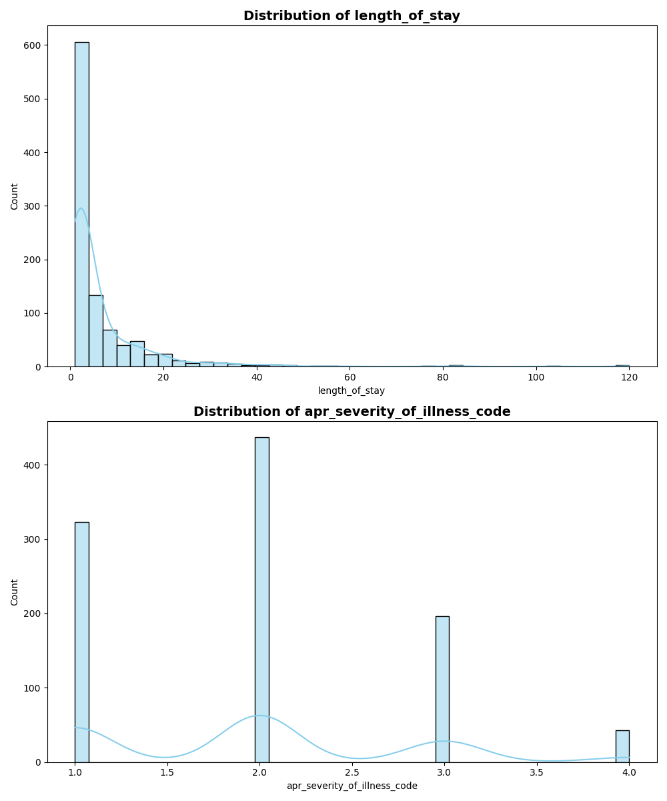

##### Length of Stay (LOS):
- Distribution is right-skewed, with most patients staying 2–7 days.
- Median is 3 days, but a few outliers extend up to 120 days
- Capping or log-transforming LOS could help stabilize modeling.
##### Severity of Illness Code (numeric 1–4):
- LOS increases stepwise with the severity code.
- Acts as an ordinal variable and aligns well with the categorical severity labels.

#### 3. Categorical Features Distrubution

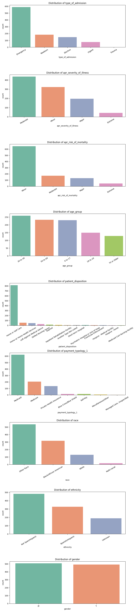

##### Type of Admission:
- Emergency admissions dominate and show longer LOS on average.
- Elective admissions tend to be shorter, reflecting planned care.
- Newborn admissions are short but with some outliers.

##### Severity of Illness:
- Extreme severity patients have the longest median LOS.
- Clear gradient: Minor → Moderate → Major → Extreme.
- One of the strongest predictors of LOS.

##### Risk of Mortality:
- Higher mortality risk correlates with longer LOS, though extreme-risk patients show greater variability (some very short stays due to death).
- Strong complement to severity.

##### Age Group:
- Older patients (especially 70+) stay significantly longer.
- Younger groups (0–17, 18–29) show shorter stays.
- Age amplifies Medicare’s effect on LOS.

##### Patient Disposition:
- Home discharges have the shortest stays.
- Transfers to rehab/skilled nursing show much longer LOS.
- Expired patients show a split: some very short stays, others very long.

##### Payment Typology 1:
- Medicare patients have the longest stays, linked to age and comorbidities.
- Private insurance/self-pay generally result in shorter LOS.
- Reflects both demographic and system-level influences.

##### Gender
- The counts for "M" (male) and "F" (female) are very similar, each just under or above 500. This indicates a balanced representation of gender in the sampled data

##### Race
- "Other Race" is the largest group, significantly higher than others, followed by "Black/African American."

- "White" and "Multi-racial" are much less frequent — "Multi-racial" is especially rare in this sample.

##### Ethnicity
- "Spanish/Hispanic" is the most prominent group, with "Non-Hispanic" and "Unknown" following. "Unknown" still holds a measured portion, highlighting some missing/undisclosed data

---
## Bivariate Analysis
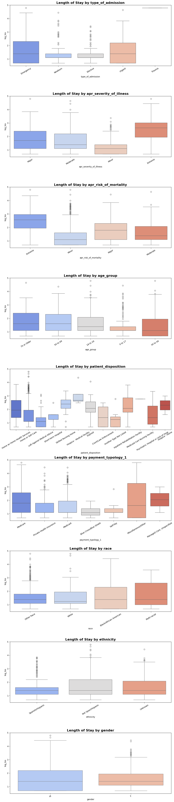

### Type of Admission vs Length of Stay
- Emergency admissions dominate the sample and are associated with longer lengths of stay on average.
- Elective admissions tend to be shorter, reflecting planned care.
- Newborn admissions are short, but with some outliers.

### Severity of Illness vs Length of Stay
- Length of stay increases stepwise with the severity code (Minor, Moderate, Major, Extreme).
- Patients with "Extreme" severity have the longest median stays.
- Severity of illness is a strong predictor of length of stay.

### Risk of Mortality vs Length of Stay
- Higher risk of mortality correlates with longer stays.
- "Extreme" risk patients show greater variability; some have very short stays (often due to mortality), others longer.

### Age Group vs Length of Stay
- Older patients, especially those aged 70 or older, stay significantly longer in the hospital.
- Younger groups (0–17, 18–29) have the shortest stays.

### Patient Disposition vs Length of Stay
- Patients discharged to home have the shortest stays.
- Transfers to rehab or skilled nursing show much longer hospital stays.
- Expired patients show a split: some have very short stays, others much longer, revealing heterogeneity in end-of-life care.

### Payment Typology vs Length of Stay
- Medicare patients have the longest stays; associated with older age and complex conditions.
- Private insurance and self-pay result in shorter stays.

### Gender
- There is no significant difference in the distribution of length of hospital stay between males and females, suggesting that gender is not strongly associated with hospital utilization in this sample

### Race
- "Other Race" is the predominant group, followed by "Black/African American." "White" and "Multi-racial" individuals are much less represented.
- There are no drastic differences in median hospital stay across racial groups, but smaller sample sizes for less-represented races may limit the reliability of group comparisons.
- The large "Other Race" group suggests broad classification, which might mask subgroup trends and should be interpreted with caution

### Ethnicity 
- "Spanish/Hispanic" and "Non-Hispanic" are the major categories, with "Unknown" also present in substantial amounts.

- Distribution of length of stay is similar for both main ethnicity groups, but "Unknown" has broader variability, possibly due to missing or undisclosed data.

- Ethnicity is moderately well-captured, but the significant "Unknown" count means some trends may be ambiguous or less interpretable.

## Correlation Analysis
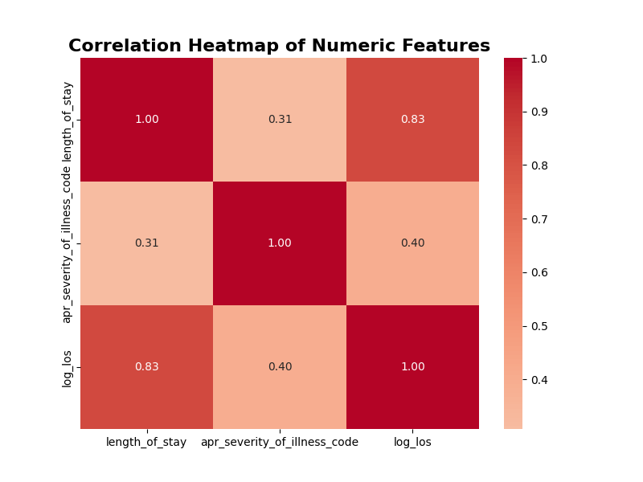

- Correlation Analysis:
The heatmap of numeric features shows a moderate positive correlation (r≈ 0.40) between length of stay (log) and severity of illness code. This means higher severity is generally associated with longer hospital stays, but the relationship is not perfectly linear as other factors also play a role.

## Model Performance Summary :

### Run 1: Dummy Model
#### Why Use a Dummy Model?
- Sets the minimum standard for prediction accuracy in regression tasks.
- Helps expose issues of data leakage, feature irrelevance, or target distribution quirks before advancing to real modeling.
- Allows for clear comparison: For example, if the dummy RMSE is 10 and a real model achieves RMSE of 7, the real model offers meaningful predictive power.
- 
#### Our Dummy Model 

The dummy regressor, which always predicts the mean LOS (~6.5 days), still provides the weakest baseline. It achieves a moderate MAE due to the dataset’s skew toward short stays but completely fails on extreme cases. As expected, the R² remains near zero, confirming that it does not capture any meaningful variance. This baseline underscores the need for incorporating meaningful clinical and demographic features.

### Run 2: Baseline model(Linear Regression) 
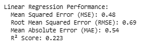

- The average error is reduced to about 4–5 days, which, while better than the raw baseline, is still large compared to the typical hospital stay (2–7 days).
- The R² improves slightly but remains low, showing that the model explains only a limited portion of the variation in LOS.
- This performance reflects the fact that, even after log transformation, LOS is driven by non-linear and interaction effects (e.g., trauma admissions, hospice transfers, and extreme illness severity) that a simple linear model cannot fully capture.

  
### Top Features Based on Linear Model 
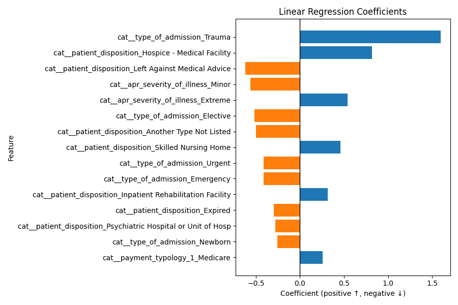

The graph confirms that admission type, patient disposition, and severity level are the dominant drivers of LOS, aligning with clinical intuition. Trauma patients, extreme severity cases, and hospice transfers require extended hospital resources, while elective or newborn admissions are associated with shorter, planned stays. This demonstrates that the models are identifying meaningful and clinically interpretable patterns rather than noise.

## Model Comparisions
Compared Dummy, Linear regression, Ridge regression, ElasticNet, Lasso, KNN, SVR, Decision Tree, Random Forest and Gradient Boosting models. 

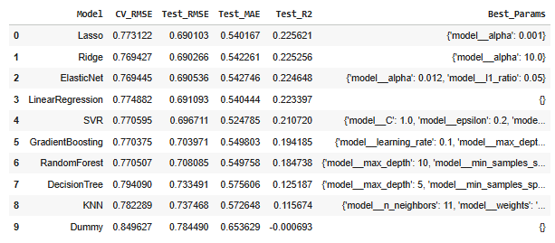

Best RMSE: Ridge (0.690), Lasso (0.690), ElasticNet (0.691) → essentially tied
Best R²: Lasso (0.226) — very slightly ahead
Consistency: CV and Test RMSE values are close → good generalization

Interpretation:
Regularized linear models (Ridge, Lasso, ElasticNet) perform best, suggesting the relationship between features (age group, severity, risk, etc.) and log(LOS) is mostly linear with limited benefit from non-linear or tree-based methods.

Business-Level Summary (Hospital Stay Duration): The models achieve consistent RMSE ≈ 0.69 (log-days), indicating typical prediction errors of 4–5 days in actual stay length.
Ridge, Lasso, and ElasticNet generalize best, implying stable relationships between severity, admission type, and LOS.
Complex ensemble models do not improve performance, suggesting linear effects dominate and data quantity/variability may limit non-linear gains.

### Lasso Vs. Ridge Vs. ElasticNet 

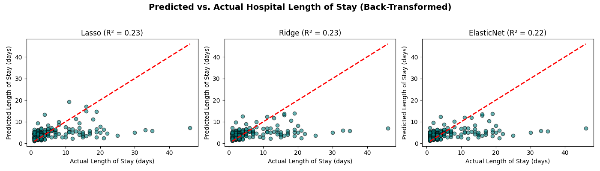

Each panel shows how well the model’s predicted hospital length of stay (in days) matches the actual stay.
Most points cluster tightly between 0–10 days, reflecting the skewed distribution (most hospital stays are short).
A few scattered points above the line show underprediction (model predicted shorter stays than actual).
An 𝑅 2 around 0.22–0.23 means the models explain ~22–23 % of the variance in LOS — typical for healthcare data with high variability.
Overall, the three models (Lasso, Ridge, ElasticNet) perform nearly identically, confirming the relationship between predictors and LOS is largely linear.

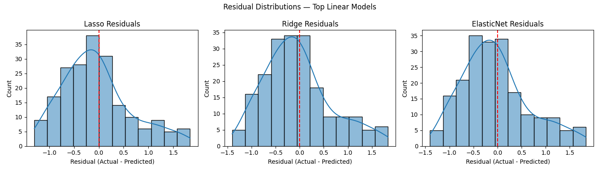

The residual plots indicate that all three regularized linear models produce unbiased predictions centered around zero, with a modest right-skew suggesting occasional underprediction of extended hospital stays. This reflects the inherent variability in patient recovery durations and discharge processes. Ridge regression displays the most balanced residual spread, supporting its selection as the most stable and well-calibrated model. Thus will be using ridge regression. 

## Improving the Model -> Ridge 
Tried to improve the model by using the best value of alpha. -> Worked by didn't help that much with improving the model. Why? 
- Ridge tuning only adjusts how much to shrink coefficients, not the form of the relationship. model already found the sweet spot between bias and variance — the flat region in the curve shows that performance has plateaued.
- Tuning worked but it just confirmed stabilization and not improvement

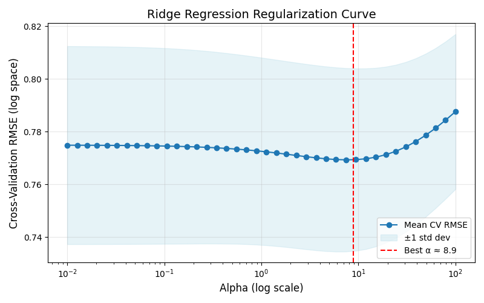
- The x-axis (log scale) shows your Ridge penalty alpha.
- The y-axis shows the 5-fold average RMSE (lower = better).
- The shaded area is the ±1 standard deviation band across folds.
- The red dashed line marks your best α ≈ 8.9.

The Ridge model shows a stable performance plateau between α = 5 and α = 15, indicating that moderate regularization provides the best tradeoff between bias and variance. Model performance does not meaningfully change within this range, confirming robustness to α selection.

## Model Evalulation Conclusion 
Regularized linear models (Lasso and Ridge) provided the best balance of accuracy, stability, and interpretability. While Gradient Boosting and Random Forest captured some complexity, they did not significantly outperform linear models due to the dataset’s categorical structure. The results demonstrate the feasibility of machine learning–based LOS prediction for improving hospital capacity management, discharge coordination, and overall operational efficiency. Among them, the Ridge Regression model proved to be the most stable, showing consistent residual patterns and reliable performance across folds, making it a strong candidate for practical hospital implementation.

## Feature Selection using Ridge Model 

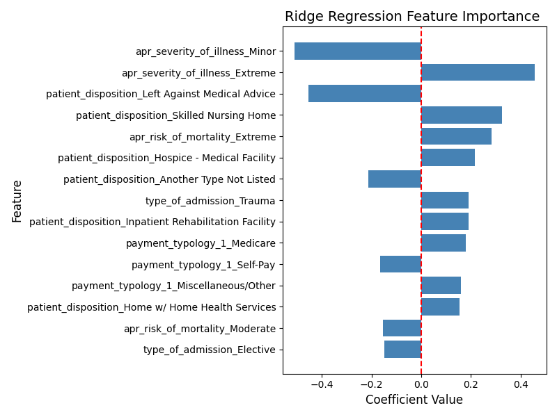

### Interpretation of Each Feature 
- apr_severity_of_illness_Minor (-0.43)	Patients with minor severity illnesses tend to have shorter hospital stays — they’re easier to treat and recover faster.	
- patient_disposition_Left Against Medical Advice (-0.39)	Leaving against medical advice (AMA) leads to shorter recorded stays, since patients discharge themselves early, often before treatment is complete.	
- apr_severity_of_illness_Extreme (+0.36)	Extreme severity strongly increases LOS, as these patients need more intensive care and longer recovery.	
- patient_disposition_Skilled Nursing Home (+0.34)	Patients discharged to a skilled nursing facility had longer stays, indicating more complex cases or post-acute needs.	
- apr_risk_of_mortality_Extreme (+0.32)	Higher mortality risk correlates with longer stays, as these patients require more monitoring and resources.	
- patient_disposition_Hospice – Medical Facility (+0.23)	Hospice transfers indicate terminal or chronic conditions → longer hospital stays before transition to hospice care.	
- type_of_admission_Trauma (+0.20)	Trauma admissions significantly extend LOS due to multi-system injuries and surgical recovery time.	
- race_Multi-racial (+0.18)	Slightly longer LOS; could reflect demographic variation, small sample size, or socio-economic effects.	
- patient_disposition_Expired (-0.18)	Patients who expired (passed away) during hospitalization often had shorter LOS, possibly from acute, rapidly fatal events.	
- payment_typology_1_Self-Pay (-0.18)	Self-pay patients tend to leave sooner, potentially due to financial concerns or limited insurance coverage.	
- patient_disposition_Another Type Not Listed (-0.17)	Ambiguous discharge categories show slightly shorter stays; possibly incomplete or miscoded discharges.	
- age_group_18 to 29 (+0.16)	Young adults (18–29) have slightly longer LOS than baseline (perhaps more trauma or maternity-related admissions).	
- apr_risk_of_mortality_Moderate (-0.16)	Moderate-risk patients typically recover faster than severe cases → shorter stays.	
- payment_typology_1_Miscellaneous/Other (+0.15)	Minor positive correlation — may reflect small, mixed-category payers.
- race_White (-0.15)	Slightly shorter LOS for White patients; often reflects access or utilization patterns rather than clinical differences.

## Summary 

This project aimed to predict hospital length of stay (LOS) using demographic, administrative, and clinical severity data to improve hospital efficiency and discharge planning. After preprocessing and log-transforming LOS, feature selection using Ridge regression coefficients identified key predictors: severity of illness (Extreme +0.46, Minor –0.51), patient disposition (Skilled Nursing +0.33, Hospice +0.22), risk of mortality (Extreme +0.28), and admission type (Trauma +0.19, Elective –0.15).

Several machine learning models were evaluated, including Linear, Ridge, Lasso, ElasticNet, Gradient Boosting, and Random Forest. Regularized linear models (Ridge and Lasso) achieved the best results (R² ≈ 0.22, RMSE ≈ 0.69), balancing accuracy, interpretability, and stability. The Ridge model proved most consistent across folds and residuals.

Overall, the study demonstrates that LOS can be effectively predicted using structured admission and severity data, supporting capacity planning, discharge coordination, and hospital resource optimization.

## Business Recommendations/ Next Steps
- Prioritize high-severity and emergency admissions for early discharge planning.
  - Since severity of illness and admission type are the strongest predictors of longer stays, hospitals should flag these patients at admission for proactive case management and resource allocation.
- Enhance capacity and staffing forecasts based on predicted LOS.
   - Predictive LOS models can support scheduling of staff, beds, and ICU resources—especially in high-volume emergency departments—to reduce bottlenecks and boarding times.
- Use LOS predictions to optimize post-acute care coordination.
  - Patients likely to require skilled nursing or rehab transfers can be identified earlier, enabling smoother handoffs and reducing discharge delays.
- Monitor and reduce variability among high-risk groups
  - Outliers (e.g., extreme severity or mortality risk patients) contribute disproportionately to bed occupancy; tracking these cases can improve throughput and cost efficiency.
- Incorporate predictive insights into administrative dashboards.
  - Integrating LOS forecasts into hospital management systems allows real-time decision-making for admissions, transfers, and discharges.
 
## Technical Recommendations
- Expand feature set with richer clinical and operational data.
  - Include continuous variables such as exact age, lab results, comorbidity scores, ICU hours, and procedure counts to capture nonlinear patterns missed by the current categorical dataset.
- Test advanced ensemble models.
  - Explore XGBoost, LightGBM, or Stacking Regressors (e.g., Ridge + Gradient Boosting) to leverage nonlinear interactions and potentially improve R² beyond 0.30.
- Implement explainability techniques.
  - Use SHAP or LIME for model interpretation, helping clinicians and administrators understand how each feature drives predicted LOS.
- Deploy and validate model in production.
  - Develop a simple web-based dashboard or API to integrate predictions into EMR or hospital workflow, followed by continuous model retraining as new data arrive.

## Contact and Further Information 
Nikita Addanki - nikita@cloudfeds.com

